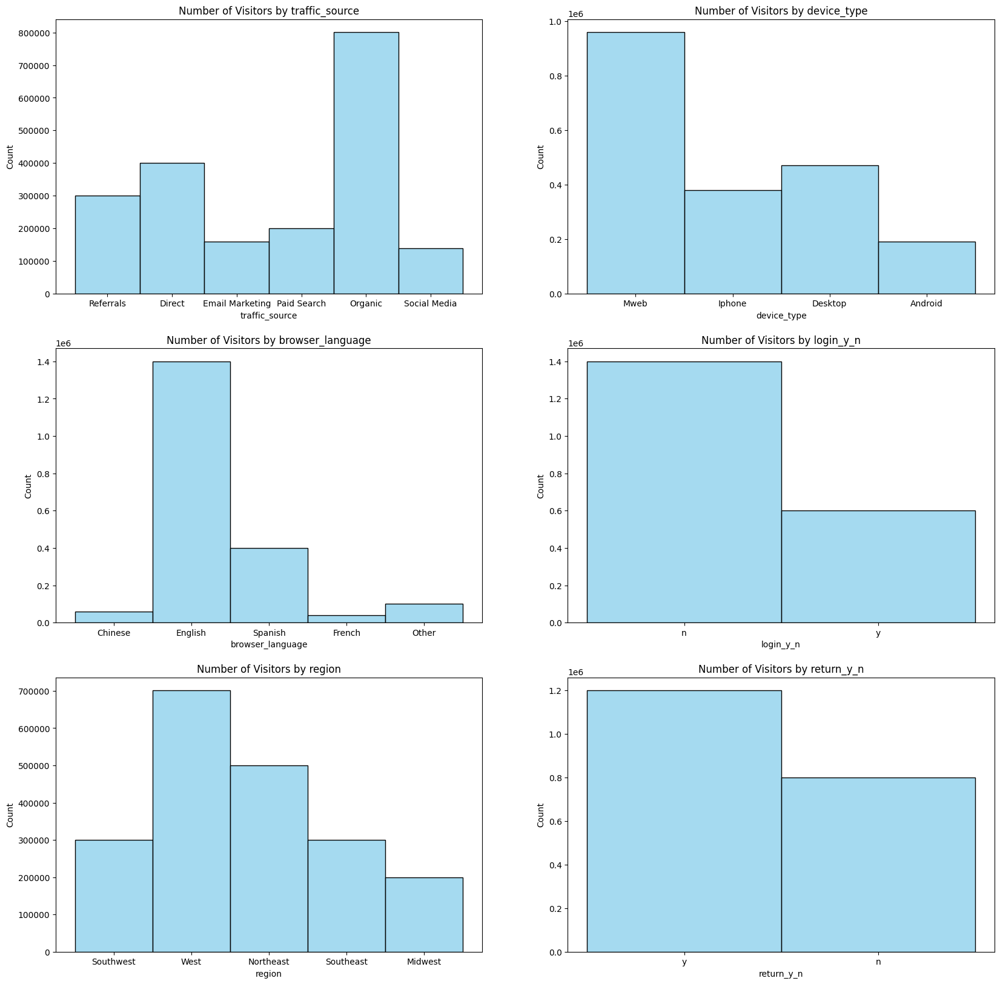
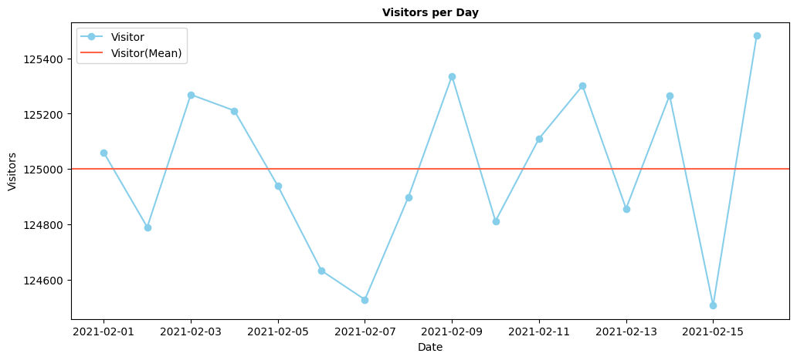
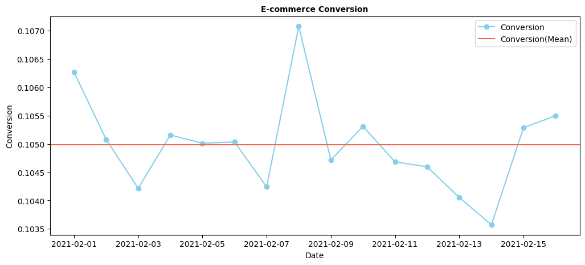
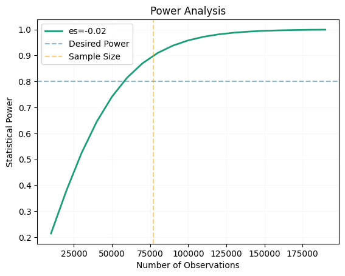
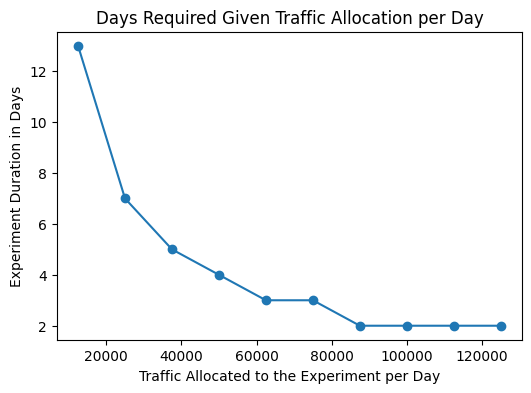
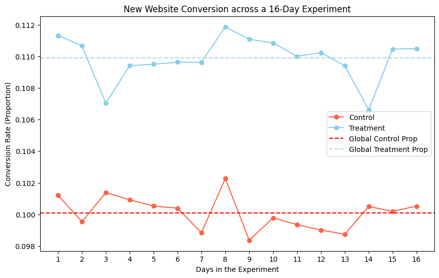

# E_commerce-AB-test

## Business Problem

This is a women’s apparel brand launching a new e-commerce website. Based on site traffic, the goal is to design, run, and analyze an A/B experiment that tests two versions of the website.

The control group will see the current (old) website, and the treatment group will see the new website. The purpose of this test is to understand whether the new version converts customers better than the old one.

## Table of Contents

1. Exploratory Data Analysis (EDA)
2. State the hypothesis
3. Design the experiment
4. Run the Experiment
5. Assess Validity Threat
6. Conduct statistical inference
7. Conclusion (Decide whether to launch the new website)

## Exploratory Data Analysis (EDA)

* Most visitors find the website through organic search, either by entering keywords or clicking on non-sponsored links.

* The majority of visitors access the site via mobile web (MWeb).

* Approximately 70% of visitors browse the website without logging in.

* Most of the site traffic comes from the western region of the United States.

* Around 60% of visitors return to the website more than once.

* The number of visitors and conversions dropped sharply over the weekend and then rebounded

## State the Hypothesis

This is followed by setting parameter values such as the significance level, statistical power, and minimum detectable effect(MDE)

Ho: Conversion rate of the old website and the new website is the same

Ha: Conversion rate of the old website and the new website is different

Alpha = 0.05
Power = 0.9
mde = 0.05

p1 = 0.1 #Control
p2 = p1 * (1+mde)

## Sample Size

To detect an effect of 5.0% lift from the pretest sign-up at 10%, the sample size per group required is 77000.
The total sample required in the experiment is 154000.

## Duration

For a 4-day experiment, 38500.0 users are required per day
For an 8-day experiment, 19250.0 users are required per day
For a 12-day experiment, 12834.0 users are required per day

## Run the Experiment

* Both groups show the highest conversion rate on Day 8 (2021-02-08, Monday), which a special event may have influenced.
* The conversion rate in the treatment group drops significantly on Day 3 and Day 14.

## Assess Validity Threats

-------- AA Test ----------

A1 Conversion Rate: 0.1
A2 Conversion Rate: 0.1

Ho: There is no difference between Group A1 and Group A2.
Ha: Group A1 and Group A2 are different.

Significance level: 0.05
Chi-Square = 0.257 | P-value = 0.613

Conclusion:
Fail to reject Ho. Therefore, proceed with the AB test.

## Conduct Statistical Inference

-------- AB Test Email Sign-Ups (2021-02-01 - 2021-02-16)---------

Ho: The conversion rates between the old website and the new website are the same.
Ha: The conversion rates between the old website and the new website are different.

Significance level: 0.05
T-Statistic = -22.591 | P-value = 0.000

Conclusion:
Reject Ho and conclude that there is statistical significance in the difference of conversion between the old website and the new website.

--------- Sample Sizes ----------

Control: 1000000
Treatment: 1000000

--------- Conversion Counts (Rates) ----------

Control: 100092 (10.0%)
Treatment: 109884 (11.0%)

--------- Differences ----------

Absolute: 0.0098
Relative (lift): 9.8%

--------- T-Stats ----------

Test Statistic: -22.590577
P-Value: 0.00000

--------- Confidence Intervals ----------

Absolute Difference CI: (0.009, 0.011)
Relative Difference (lift) CI: (8.9%, 10.6%)

### In this E-commerce website conversion test, the objective was to increase the conversion rate by introducing a redesigned website.

### A randomized controlled experiment was conducted from 2021-02-01 to 2021-02-16, assigning users to either the control group (old website) or the treatment group (new website).

### The experiment showed a 9.8% lift in conversion compared to the benchmark (old website), exceeding the 10% improvement target. The result was statistically significant, with a 95% confidence interval ranging from 9% to 11%.

### Given the strong practical and statistical significance of the improvement, our recommendation is to proceed with the launch of the new website.
